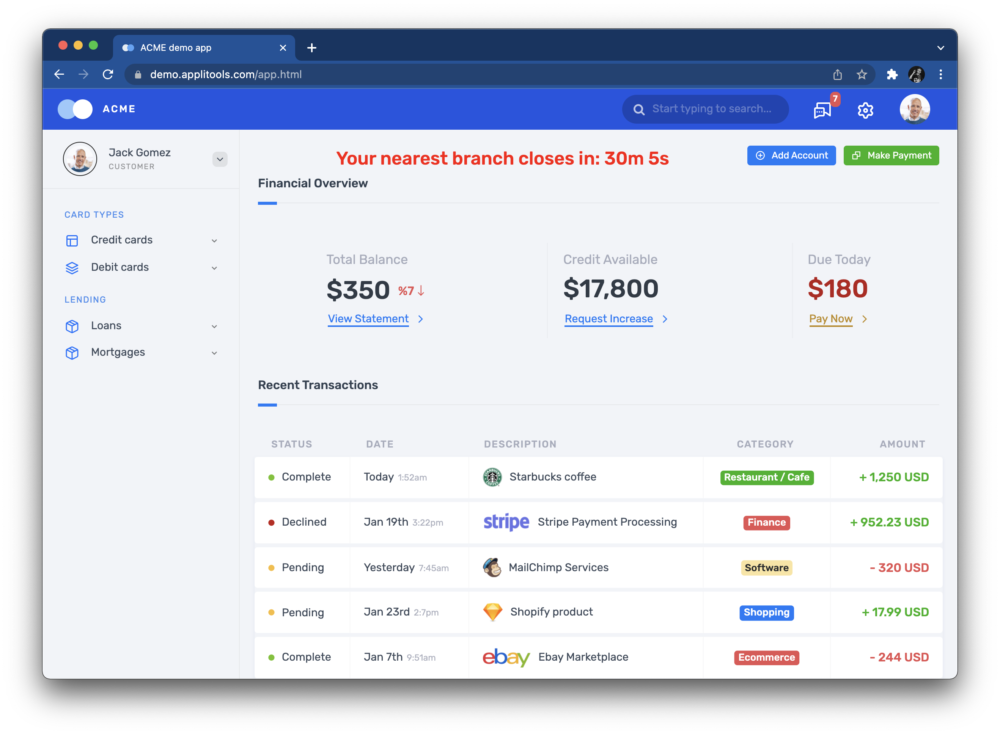

# Workshop Walkthrough

This guide provides a full written walkthrough for the
[Modern Cross-Browser Testing](https://applitools.com/crossbrowser-testing-workshop/) workshop
led by [Pandy Knight](https://twitter.com/AutomationPanda)
and hosted by [Applitools](https://applitools.com/)
on December 16, 2021.
You can follow along with it during the live event,
or you can reference it afterwards to help you learn more.


## 1. Traditional cross-browser testing

Traditional cross-browser testing requires lots of work,
both in automating test cases and in maintaining testing infrastructure.
Let's give this a try ourselves to see what it takes.


### Writing a typical login test

Web UI testing is all about app behaviors:
interacting with visual interfaces and verifying outcomes.
Let's automate a simple website login test to use for cross-browser testing.
We will use the [Applitools demo site](https://demo.applitools.com):
`https://demo.applitools.com`.

The test steps are straightforward:

```gherkin
Scenario: Successful login
  Given the login page is displayed
  When the user enters their username and password
  And the user clicks the login button
  Then the main page is displayed
```

The login page looks like this:


And the main page looks like this:



We can automate this test in many ways,
but for this workshop,
we will build a Java [Maven](https://search.maven.org/) project
with [JUnit 5](https://junit.org/junit5/)
and [Selenium WebDriver](https://www.selenium.dev/documentation/webdriver/).
In this repository,
[`src/test/java/com/applitools/TraditionalTest.java`](src/test/java/com/applitools/TraditionalTest.java)
is an automated implementation of this login test.
As typical for WebDriver-based tests,
this test class has `WebDriver` and `WebDriverWait` instance variables
that are initialized before each test and cleaned up after each test:

```java
public class TraditionalTest {
    
    private WebDriver driver;
    private WebDriverWait wait;

    @BeforeEach
    public void startWebDriver() {
        driver = new ChromeDriver();
        wait = new WebDriverWait(driver, 15);
    }

    @AfterEach
    public void quitWebDriver() {
        driver.quit();
    }
    
    // ...
}
```

The login test itself is broken down into parts with helper methods:

```java
    @Test
    public void login() {
        loadLoginPage();
        verifyLoginPage();
        performLogin();
        verifyMainPage();
    }
```

Loading the login page looks like this:

```java
    private void loadLoginPage()
    {
        driver.get("https://demo.applitools.com");
    }
```

Once the login page is loaded, the test verifies that certain things appear:

```java
    private void waitForAppearance(By locator)
    {
        wait.until(d -> d.findElements(locator).size() > 0);
    }

    private void verifyLoginPage()
    {
        waitForAppearance(By.cssSelector("div.logo-w"));
        waitForAppearance(By.id("username"));
        waitForAppearance(By.id("password"));
        waitForAppearance(By.id("log-in"));
        waitForAppearance(By.cssSelector("input.form-check-input"));
    }
```

These assertions explicitly wait for a specific set of elements to appear.
They check purely for appearance – not for any shape, size, or look.

Performing login requires a few WebDriver interactions:

```java
    private void performLogin()
    {
        driver.findElement(By.id("username")).sendKeys("andy");
        driver.findElement(By.id("password")).sendKeys("i<3pandas");
        driver.findElement(By.id("log-in")).click();
    }
```

Once login is complete, the main page appears.
Unfortunately, there's almost too much on the main page to check!
The test picks a few important things and makes several assertions:

```java
    private void verifyMainPage()
    {
        // Check various page elements
        waitForAppearance(By.cssSelector("div.logo-w"));
        waitForAppearance(By.cssSelector("div.element-search.autosuggest-search-activator > input"));
        waitForAppearance(By.cssSelector("div.avatar-w img"));
        waitForAppearance(By.cssSelector("ul.main-menu"));
        waitForAppearance(By.xpath("//a/span[.='Add Account']"));
        waitForAppearance(By.xpath("//a/span[.='Make Payment']"));
        waitForAppearance(By.xpath("//a/span[.='View Statement']"));
        waitForAppearance(By.xpath("//a/span[.='Request Increase']"));
        waitForAppearance(By.xpath("//a/span[.='Pay Now']"));

        // Check time message
        assertTrue(Pattern.matches(
                "Your nearest branch closes in:( \\d+[hms])+",
                driver.findElement(By.id("time")).getText()));

        // Check menu element names
        var menuElements = driver.findElements(By.cssSelector("ul.main-menu li span"));
        var menuItems = menuElements.stream().map(i -> i.getText().toLowerCase()).toList();
        var expected = Arrays.asList("card types", "credit cards", "debit cards", "lending", "loans", "mortgages");
        assertEquals(expected, menuItems);

        // Check transaction statuses
        var statusElements = driver.findElements(By.xpath("//td[./span[contains(@class, 'status-pill')]]/span[2]"));
        var statusNames = statusElements.stream().map(n -> n.getText().toLowerCase()).toList();
        var acceptableNames = Arrays.asList("complete", "pending", "declined");
        assertTrue(acceptableNames.containsAll(statusNames));
    }
```

Some assertions just check that elements appear.
Others check aspects of elements, like text values.
Nevertheless, the element locators and the code for performing these assertions are a bit complex.
They also do *not* cover everything on the page.
There's risk that unchecked things could break.


### Running the test locally

SCREENSHARE

* Run the test with Chrome
* Remember to have ChromeDriver installed
* Yay, it passes


### Updating the test to handle multiple browsers

SCREENSHARE

* Recommended practice: one test launch points to one browser
* Parameterizing tests becomes sloppy and repetitive
* Theoretically, any site should run on any browser
* Update setup to switch between Chrome and Firefox
* Run it once with Firefox


### Scaling out cross-browser testing yourself

SLIDES

* Local testing has limits: browser choices, versions, and parallel scale
* Show device count somehow
* Anecdotal optimal execution time: 1 web test per processor/core
* You could build your own Selenium Grid
* I did this at Q2; share the case study
* VMs running in Azure with scripts to power on and off
* Tests ran fast, but startup took a few minutes
* Figuring it all out took MONTHS
* We had to be picky about our browser choices (thankfully, no mobile)
* Maintenance was a CHORE (every Chrome update)
* Random crashes happened that are hard to debug
* Image: VW Beetle maintenance


### Scaling out cross-browser testing as a service

SLIDES

* Vendors make it a little easier to run cross-browser testing
* Less setup and maintenance time
* They provide all the browser, OS, and platform combos
* They also provide nice features like dashboards, screenshots, and videos
* But tests run much slower: anecdotally 2-4x slowdown
* It's also very, very expensive
* It's also sometimes unreliable! (esp. for mobile?)
* Security is challenging because communication must go two ways
* It's still hard to debug
* I've used Sauce Labs, CrossBrowserTesting, and LambdaTest


## 2. Modern cross-browser testing

There's got to be a better way to do cross-browser testing!
Let's rethink our approach in what we want to test
and how techniques like visual testing can simplify things.


### Reconsidering what should be tested

SLIDES

* What's the purpose of "cross-browser testing"?
* CBT makes sure that web apps work in different environments
* These days, browsers have standardized on JavaScript functionality
* It's more important to test rendering, visuals, and responsiveness
* Those are the things that are different across browsers


### Introducing Applitools Ultrafast Grid

SLIDES

* Visual testing with Ultrafast Grid!
* Explain how it works
* Snapshots in a single direction
* Check any browsers and platforms you want


### Rewriting login as a visual test

SCREENSHARE

* Rewrite test with Eyes SDK
* Revisit assertions: they are complicated
* Rerun original test with changed demo site, and the test still passes!
* Show how config is declarative and sharable
* Show how assertions are simplified: "A picture is worth a thousand assertions."


### Running visual tests across multiple browsers

SCREENSHARE

* Run tests using Ultrafast Grid
* Show Applitools dashboard with baselines and stuff
* Explain browsers, OS's, versions
* Show groupings
* Rerun tests with the changed demo site
* Determine visual failures
* Highlight advantages: speed, simplicity, accuracy


### Integrating modern cross-browser testing with CI/CD

SLIDES
SCREENSHARE (if we include GitHub Actions)

Lip service about CI/CD integration.
We have plugins for Jenkins, etc.
Bring up how slower CBT makes true Continuous Testing tough - it requires tradeoffs.
Ultrafast Grid shifts testing further left.

Maybe write GitHub Actions?
